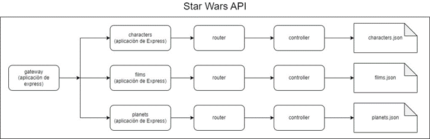
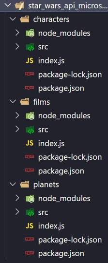
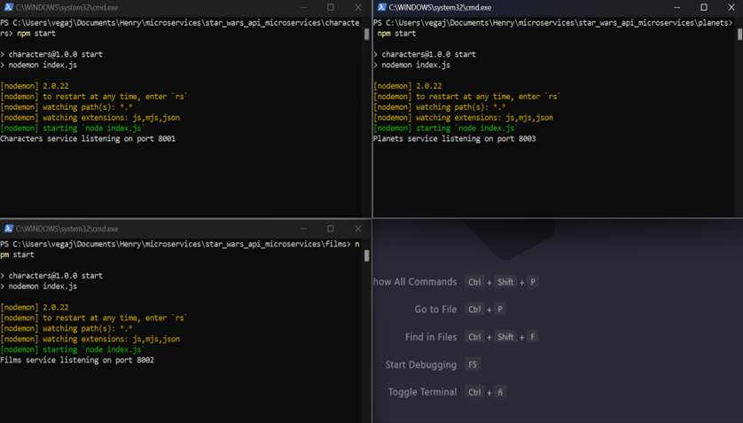

# Módulo 1

# ¿Qué aprenderemos?

- **Comprender la arquitectura de microservicios** y cómo se diferencia de la arquitectura monolítica.
- **Diseñar una aplicación** utilizando la arquitectura de microservicios.

<br>

# Introducción a la arquitectura

**La arquitectura de microservicios** es un enfoque moderno para desarrollar y desplegar aplicaciones de software que se basa en la idea de construir aplicaciones como **un conjunto de servicios pequeños, autónomos y altamente escalables** que se ejecutan de forma independiente y se comunican entre sí a través de interfaces bien definidas.

> Cada microservicio se enfoca en una única funcionalidad o tarea específica y se puede desarrollar, desplegar y escalar de manera independiente, lo que permite una mayor flexibilidad y agilidad en el desarrollo de aplicaciones.

A diferencia de la **arquitectura monolítica**, donde todas las funcionalidades se encuentran integradas en una única aplicación, la arquitectura de microservicios promueve la división de la aplicación en pequeños servicios independientes que pueden ser desarrollados, desplegados y escalados de forma individual. **Cada microservicio se ejecuta en su propio entorno**, con su propia base de datos, configuración y recursos, lo que permite una mayor modularidad y autonomía.


Una de las principales características de la arquitectura de microservicios es la **comunicación a través de interfaces** bien definidas. Los microservicios se comunican entre sí a través de interfaces, como **API RESTful, mensajes asincrónicos o eventos**, lo que permite una mayor desacoplamiento entre los servicios y facilita la integración y evolución de la aplicación en el tiempo.

Además, la arquitectura de microservicios fomenta el uso de tecnologías y herramientas que facilitan la automatización, el monitoreo y la gestión de los servicios, como contenedores, orquestadores, herramientas de descubrimiento de servicios, entre otros.

<br>

# Pros y contras

> Toda arquitectura de desarrollo de software tiene fortalezas (Pros), desventajas (Contras) y limitaciones dependiendo del contexto y objetivo del proyecto.

A continuación vamos a conocer cuales son las ventajas (Pros) de la arquitectura de microservicios:

<details>
  <summary><b>Escalabilidad</b></summary>
  
  Los microservicios permiten escalar cada servicio de forma independiente, lo que permite adaptar la capacidad de la aplicación a las necesidades específicas, optimizando el uso de recursos.
</details>

<details>
  <summary><b>Flexibilidad y agilidad</b></summary>
  
  Los microservicios facilitan la implementación de cambios y actualizaciones en la aplicación de manera rápida y aislada, sin afectar a otros servicios, lo que permite una mayor flexibilidad y agilidad en el desarrollo y despliegue de aplicaciones.
</details>

<details>
  <summary><b>Modularidad</b></summary>
  
  Los microservicios se enfocan en una única funcionalidad o tarea, lo que permite una mayor modularidad en el diseño y desarrollo de la aplicación. Esto facilita la reutilización, el mantenimiento y la evolución de los servicios de forma individual.
</details>

<details>
  <summary><b>Independencia tecnológica</b></summary>
  
  Cada microservicio puede utilizar diferentes tecnologías, bases de datos y frameworks, lo que permite una mayor libertad en la elección de tecnologías y herramientas adecuadas para cada servicio, sin estar limitado por una única tecnología en toda la aplicación.
</details>

<details>
  <summary><b>Desacoplamiento</b></summary>
  
  Los microservicios se comunican a través de interfaces bien definidas, lo que permite un bajo acoplamiento entre los servicios. Esto facilita la integración con otros sistemas y permite una mayor evolución y compatibilidad de la aplicación en el tiempo.
</details>  
  
<br>

Luego de conoces sus fortalezas, también es fundamental conocer las **limitaciones o desventajas** de este tipo de arquitectura.

<details>
  <summary><b>Complejidad</b></summary>
  
  La gestión de un sistema distribuido de microservicios puede ser compleja, ya que implica la orquestación, monitorización y gestión de múltiples servicios en diferentes entornos.
</details>

<details>
  <summary><b>Mayor overhead</b></summary>
  
  La comunicación entre microservicios puede tener un overhead adicional, como la latencia de red y la necesidad de implementar mecanismos de seguridad y gestión de errores en las interfaces de comunicación.
</details>

<details>
  <summary><b>Mayor esfuerzo de desarrollo inicial</b></summary>
  
  La construcción de una arquitectura de microservicios puede requerir un mayor esfuerzo de desarrollo inicial para la creación y configuración de múltiples servicios, infraestructuras de comunicación y herramientas de gestión.
</details>

<details>
  <summary><b>Mayor complejidad en el despliegue</b></summary>
  
  El despliegue de microservicios puede requerir una mayor complejidad en la gestión de la infraestructura, como el uso de herramientas de orquestación de contenedores y sistemas de descubrimiento de servicios.
</details>

<details>
  <summary><b>Reto en la gestión de transacciones</b></summary>
  
  La gestión de transacciones en una arquitectura de microservicios puede ser más compleja, ya que las transacciones distribuidas pueden ser difíciles de manejar entre diferentes servicios.
</details>

<br>

# Introducción a Docker

> "Es una plataforma de virtualización a nivel de sistema operativo que permite la creación, empaquetado y distribución de aplicaciones en contenedores. Los contenedores Docker son aislados y encapsulan todo lo necesario para que una aplicación se ejecute de manera consistente en cualquier entorno, independientemente de las diferencias en la infraestructura subyacente"  
> RedHat.com

### **En otras palabras, podemos decir que...**

Docker es una herramienta que te permite **empaquetar tu aplicación Node.js, junto con todas sus dependencias y configuraciones**, en un 'contenedor' portátil. Este contenedor se asemeja a un caja virtual que contiene todo lo necesario para que tu aplicación Node.js funcione correctamente, incluyendo la versión específica de Node.js, las bibliotecas y todos los paquetes de npm necesarios.

Imagina que tu aplicación Node.js es una casa con sus propios muebles y electrodomésticos. Docker sería como una caja de mudanza que empaca todos los elementos necesarios para tu casa en un solo lugar, de manera ordenada y segura. Luego, puedes llevar esa caja de mudanza a cualquier lugar, como un nuevo servidor o el entorno de desarrollo de tu colega, y asegurarte de que todos los elementos de tu casa estén en su lugar correcto y funcionando sin problemas.

[En el siguiente video 👀 podrás conocer la importancia de Docker y su potencial](https://www.youtube.com/watch?v=-bS36SMr2Yw)

Además de los beneficios comentados en el video anterior, **Docker** es una herramienta extremadamente útil al **trabajar con microservicios** por varias razones que detallamos a continuación:

<details>
  <summary><b>Independencia de dependencias</b></summary>
  
  Los microservicios suelen ser pequeñas aplicaciones o componentes de una aplicación más grande que se ejecutan de forma independiente. Cada microservicio puede tener sus propias dependencias y configuraciones específicas. Docker permite empaquetar cada microservicio junto con sus dependencias en un contenedor independiente. Esto asegura que cada microservicio tenga su propio entorno aislado y no se vea afectado por las dependencias de otros microservicios o del sistema operativo en el que se ejecutan.
</details>

<details>
  <summary><b>Portabilidad</b></summary>
  
  Docker permite empaquetar un microservicio y todas sus dependencias en un contenedor, lo que lo hace altamente portátil. Puedes mover fácilmente el contenedor de un entorno a otro, como de desarrollo a producción, o entre diferentes servidores o plataformas en la nube. Esto facilita la implementación y despliegue de microservicios en diferentes entornos sin preocuparse por las diferencias en la configuración del sistema operativo o las dependencias.
</details>

<details>
  <summary><b>Escalabilidad</b></summary>
  
  Los microservicios suelen diseñarse para escalar horizontalmente, lo que significa que se pueden ejecutar varias instancias del mismo microservicio para manejar cargas de trabajo crecientes. Docker facilita la replicación y el escalado de microservicios al permitir la creación de múltiples contenedores a partir de la misma imagen de Docker. Esto hace que sea sencillo agregar o quitar instancias de microservicios según sea necesario para adaptarse a los cambios en la demanda.
</details>

<details>
  <summary><b>Consistencia y reproducibilidad</b></summary>
  
  Docker asegura que los microservicios se ejecuten de la misma manera en todos los entornos, lo que garantiza la consistencia en el desarrollo, prueba y producción. Además, Docker permite definir la configuración del contenedor en un archivo llamado Dockerfile, lo que facilita la reproducción del entorno de ejecución del microservicio en diferentes etapas del ciclo de vida del desarrollo de software, desde el desarrollo local hasta la producción.
</details>

<details>
  <summary><b>Facilidad en la gestión</b></summary>
  
  Docker proporciona una interfaz de línea de comandos y una interfaz gráfica de usuario que facilita la gestión de los contenedores de microservicios. Puedes iniciar, detener, reiniciar o eliminar contenedores con simples comandos o acciones de interfaz gráfica. Además, Docker tiene una amplia comunidad y un ecosistema de herramientas y servicios que facilitan la gestión y monitoreo de microservicios.
</details>

<br>

# Instalación de Docker

Luego de conocer los beneficios de Docker, vamos a **instalar la aplicación** en tu sistema operativo.

[En el siguiente video podrás conocer como instalar Docker en Windows](https://www.youtube.com/watch?v=BK-C2RofmTE&t=16s)

Luego de instalar Docker correctamente, vamos explorar cómo crear un Aplicación de NodeJS en Docker.

[Enlace](https://www.youtube.com/watch?v=iLlmm0L-VpQ&t=47s)

En el video anterior se demostró como crear una aplicación sencilla en Docker, ahora vamos a poner manos a la obra para comenzar con nuestra primera **Homework**.

<br>

# Proyecto Star Wars API

Para esta actividad deberás contar con este [repositorio](https://github.com/soyHenry/be-ct-upskilling-microservicios) (o la carpeta repositorio), será la base de lo que estaremos creando. Este proyecto se trata de una **API de Star Wars**, que maneja información sobre los personajes de la franquicia (Characters), las películas que se han lanzado (Films) y los planetas que aparecen en dichas películas (Planets).

Podrás notar que este repositorio contiene un proyecto de **Nodejs** similar a los que ya has desarrollado durante la carrera:

1. Un servidor web HTTP creado con la librería Express.
2. Un enrutador al cual el servidor le delega el enrutado de la aplicación.
3. Tres (3) routers que se encargan de definir rutas para cada una de las entidades que trabajamos (Films, Characters y Planets).
4. Los controladores de las rutas no se comunican (por el momento) con ninguna Base de Datos, sino que obtienen los datos a partir de unos archivos Json que contienen los registros para cada una de las entidades.


Te dejamos además un vistazo del **package.json** que posee hasta el momento con las dependencias instaladas. Por el momento **no necesitaremos más dependencias que estas**.


Tanto la estructura del proyecto como las funcionalidades que posee hasta el momento son las que ya conocemos. Esta aplicación, como verás, se ajusta a la **estructura monolítica** que vimos en pasos anteriores:

- Cuenta con una única aplicación de Express que se encarga de manejar todo el servicio.
- Toda la aplicación se expone en un único puerto del host donde se encuentre.
- Si bien la lógica de negocio de la aplicación se irá definiendo en rutas y enrutadores distintos, al final del camino todo forma parte de una única aplicación.

## -------------------- **Clase** --------------------

El objetivo es poder hacer que toda la lógica este dividida en microservicios. Cuando hablamos de microservicios, estamos hablando de pequeñas aplicaciones de Express en nuestro caso.

Nuestro objetivo es poder hacer que tengamos tres aplicaciones pequeñas, una que se encargue de gestionar la información de los personajes, otra que se encargue de gestionar la información de las películas y otra de los planetas.

Los controladores de las rutas, manejan los datos de un json, más adelante lo pasaremos a una base de datos. Vamos a ver que la gestión de los datos en la base de datos, también sea un microservicio aparte.

## -------------------- **Fin clase** --------------------

<br>

# HW 1 - Actividad 1

Esta primera Homework está estructurada en dos actividades con objetivos muy específicos:

## Actividad 1

Debes lograr **dividir esta aplicación en aplicaciones más pequeñas y sencillas**, que involucren un único aspecto, entidad o funcionalidad del proyecto.

El objetivo es dividir nuestro proyecto en una estructura similar a la siguiente:



Como podrás ver 👀, contaremos con una **API Gateway** que se encargará de redirigir las peticiones al servicio que corresponda según la petición. Este gateway no es más que una aplicación de Express que escuchará las peticiones en un puerto de tu host.

A su vez, **cada uno de estos servicios será una aplicación de Express individual**, que estará escuchando peticiones en un puerto distinto y que contará también con sus capas (capa de enrutado, capa de controladores, capa de datos "por el momento los .json").

Respecto a cómo la API Gateway redirigirá las peticiones, lo hará realizando nuevas peticiones HTTP a los host:port donde estén escuchando cada uno de los demás servicios.

De esta manera, el cliente realizará sus peticiones **ÚNICAMENTE al API Gateway**, y será este quien se encargue de comunicarse con los microservicios involucrados en cada petición.

> Para llevar adelante esta actividad te recomendamos que **inicies una nueva carpeta** dentro de la cual podrás trabajar cada uno de los proyectos de Node por separado. Puedes incluir cualquier dependencia que quieras o creas necesaria aparte de las propuestas en el package.json original.

<br>

## ¡Debemos ir por partes! (PASO 1)

Como primer paso es recomendable **separar para cada una de las entidades que estamos manejando una aplicación de Express diferente**. Cada una de ellas contará con la estructura básica ya conocida de las aplicaciones de esta naturaleza.

Para este paso es recomendable trabajar cada una de las aplicaciones como algo totalmente independiente del resto de la estructura. Como si estuvieras haciendo una Rest API súper sencilla que maneja datos de una única entidad.

Al final de este paso deberías tener algo similar a lo siguiente:





## -------------------- **Clase** --------------------

Iniciamos el proyecto.

Vamos a crear el servicio de `characters`. Lo mismo hay que hacer con los otros servicios.

Iniciamos el proyecto:

```bash
npm init -y
```

Voy creando la carpeta `src` y el archivo `index.js`. También voy instalando algunas dependencias:

```bash
npm i express morgan
```

Creamos el archivo `server.js` dentro de la carpeta `src` donde creamos nuestro servidor de Express:  
`server.js`

```js
const express = require("express");

const server = express();

module.exports = server;
```

Completamos el archivo `index.js` y lo pongamos a escuchar en el puerto `8001` y los otros servicios lo puedo poner a escuchar en el puerto `8002` y `8003` respectivamente:  
`index.js`

```js
const server = require("./src/server");

const PORT = 8001;

server.listen(PORT, () => {
  console.log(`Characters service listening on port ${PORT}`);
});
```

Agregamos `nodemon`:

```bash
npm i nodemon -D
```

Modificamos el archivo `package.json`:  
`package.json`

```json
{
  "scripts": {
    "start": "node index.js",
    "dev": "nodemon index.js"
  }
}
```

Ahora lo podemos correr:

```bash
npm run dev
```

Creo una carpeta `data` y `routes` dentro de `src` para ir estructurando.

Vamos a seguir configurando `server.js`:

```js
const express = require("express");
const morgan = require("morgan");

const server = express();

server.use(morgan("dev"));
server.use(express.json());

module.exports = server;
```

Creamos un archivo `index.js` en la carpeta `routes` y lo vamos completando, para que el `server.js` pueda requerirlo y a partir de allí empezar a delegar este servicio:  
`routes/index.js`

```js
const { Router } = require("express");

const router = Router();

module.exports = router;
```

`server.js`

```js
const express = require("express");
const morgan = require("morgan");

const server = express();

server.use(morgan("dev"));
server.use(express.json());

server.use(require("./routes"));

module.exports = server;
```

Ahora vamos a ver la estructura o las capas que le vamos a dar cuando vayan pasando nuestra `requests`.

Si el `gateway` ha hecho llegar la `request` al microservicio de `characters`, es por que ya es de `characters`.

Voy a crear un controlador, que es la función que administra la lógica, donde esta volcada toda la lógica de negocio para algún endpoint en particular.

Por eso lo más recomendable, es trabajar con una carpeta de `controllers`, la creamos, para que podamos tener todas las funciones definidas en otros módulos.

Es bastante recomendable crear en la carpeta `controllers`, un archivo `index.js`, que va a ser el índice de todos los controladores que haya en esta carpeta:  
`controllers/index.js`

```js
module.exports = {
  getCharacters: require("./getCharacters"),
  createCharacter: require("./createCharacter"),
};
```

Creamos `getCharacters.js` y `createCharacter.js`:  
`controllers/getCharacters.js`

```js
module.exports = (req, res) => {
  res.status(200).send("personajes");
};
```

`controllers/createCharacter.js.js`

```js
module.exports = (req, res) => {
  res.status(200).send("creando personaje");
};
```

Agregamos en el `index.js` de la carpeta `routes`, indicandoles las `callback` que se ejecuta en cada endponint:  
`routes/index.js`

```js
const { Router } = require("express");
const controllers = require("../controllers");

const router = Router();

router.get("/", controllers.getCharacters);

router.post("/", controllers.createCharacter);

module.exports = router;
```

Esta forma de trabajar, tiene una gran ventaja en el manejo de errores. Si trabajamos de forma correcta y bien modularizada, podemos tener un manejo de errores teniendo un código que se encargue de esto y sea eficiente.

Dentro de la carpeta `data`, deberíamos tener el `character.json`, sino lo traemos de la carpeta original de cuando empezamos la actividad.

Vamos a empezar a usar este archivo `json`, ya que no tenemos una base de datos real.

Vamos a empezar a crear la capa de datos de este microservicio.

Vamos a crear un archivo `index.js` dentro de la carpeta `data` para traer el `json`. Vamos a definir unas funciones que simulara ser el modelo. La función `list` retorna los personajes que hay en el `json`. Ahora lo saca de `json`, pero más adelante lo puede sacar de una base de datos, de un array, etc:

Ahora lo usamos en `getCharacters`, que lo utiliza como si fuera un modelo más, que podría ser de una base de datos, pero es un modelo de mentira, pero que está funcionando. Lo que logro es que ya pueda dejar planteado del lado del controlador cual es el código con el que después voy a usar en la base de datos. `Character` luego será un modelo de una base de datos no relacional, pero cuando eso cambie, el controlador no va a cambiar absolutamente en nada.
Y para asegurarnos que no cambie, le voy a decir que función `list` sea asíncrona, para que ya definitivamente simular ese comportamiento:  
`routes/index.js`

```js
const planets = require("./planets.json");

module.exports = {
  list: async () => {
    return planets;
  },
};
```

Completamos `getCharacters.js`:  
`getCharacters.js`

```js
const Characters = require("../data");

module.exports = async (req, res) => {
  const characters = await Characters.list();
  res.status(200).json(characters);
};
```

Más adelante vamos a ver una mejor forma de manejar errores que un `try...catch`.

Toda esta actividad la podemos replicar con `films` y `planets`.

## -------------------- **Fin clase** --------------------

<br>

## -------------------- **Clase** --------------------

Vamos a ver BUENAS PRÁCTICAS que debes cuidar para realizar con éxito tu proyecto.

Cuando hacemos un pedido a una ruta `get`, no es muy buena práctica mandar la data plana.

Para empezar, voy a crear una carpeta `utils`.

Cuando hablamos de `utils` estamos hablando de una función que va a hacer algo muy específico, que puede ser un proceso que generalmente es sencillo, muy puntual, que puede ser algo como formatear un array, que reciba un dos strings y forme un objeto, etc., y que nosotros tranquilamente podríamos reutilizarlas en otros proyectos. Me pregunto si es algo muy particular de mi proyecto, o yo me puedo llevar esta función a otro proyecto y reutilizarla también, eso sería un `utils`.

Un `helper` es algo más específico del proyecto que estoy trabajando.

Voy a crear un archivo `index.js` en la carpeta `utils`, donde voy a utilizar las funciones en `utils`:  
`utils/index.js`

```js
module.exports = {
  response: require("./response"),
};
```

Voy a crear `response.js` en `utils`. Queremos que esta función se encargue de responder, de enviar la respuesta, que haga el `res.status…` y que cada vez que enviemos una respuesta reutilicemos esta función. Las respuestas van a ser coherentes y van a cumplir con esta estructura. Podría enviar mas información, según lo que necesite:  
`response.js`

```js
module.exports = (res, statusCode, data) => {
  res.status(statusCode).json({
    error: false,
    data,
  });
};
```

Agregamos a `getCharacters.js`, y `response` va a ser la función que se encargue de elaborar esa respuesta:  
`getCharacters.js`

```js
const Planets = require("../data");
const { response } = require("../utils");

module.exports = async (req, res) => {
  const planets = await Planets.list();
  response(res, 200, planets);
};
```

Ahora empecemos a pensar el manejo de los errores.

Por ejemplo que al crear un personaje, ocurre un error:

```js
module.exports = (req, res) => {
  throw Error("Hubo un error");
  res.status(200).send("creando personaje");
};
```

Cuando nosotros hagamos la petición de tipo post a `characters`, me larga un error.
Hay varias cosas para marcar. Por un lado, la aplicación no ha dejado de funcionar, me ha mostrado el `error`, pero ha logrado enviar la respuesta con un `error 500`, pero la aplicación continua, no dejo de funcionar.

Distinto es cuando esta función es `async`. De hecho, cuando lo tengamos listo, lo va a ser. Si hacemos ahora esta petición, la aplicación se apagó:

```js
module.exports = async (req, res) => {
  throw Error("Hubo un error");
  res.status(200).send("creando personaje");
};
```

Una aplicación creada con `Express` tiene un manejador de errores propio invisible, no lo escribimos nosotros, está ahí en algún lugar. Y ahora vamos a ir a donde está y como lo podemos mejorar. Pero ese manejador de errores, va a tomar automáticamente todos los errores que sean síncronos, es decir cualquier error de naturaleza sincrónica que ocurra en nuestra aplicación va a ser tomado automáticamente por ese manejador de errores, y ese manejador de errores por defecto, va a responder con un `status 500` y va a enviar una traza del error que ha ocurrido.

Cuando los errores ocurran en operaciones o funciones de naturaleza asíncrona, ese manejador de errores no logra capturar ese error y no logra manejarlo o al menos no automáticamente, entonces nosotros tenemos como ayudarlo.

Continuemos agregando una función `create`, en esta función vamos a intentar de crear el personaje. Por el momento vamos a simular que estamos haciendo mal:  
`data/index.js`

```js
const characters = require("./characters.json");

module.exports = {
  list: async () => {
    return characters;
  },

  create: async () => {
    throw Error("Hay un error al momento de crear el personaje");
  },
};
```

Importamos el modelo al controlador:  
`createCharacter.js`

```js
const Characters = require("../data");
const { response } = require("../utils");

module.exports = async (req, res) => {
  const newCharacter = await Characters.create();
  response(res, 201, "Personaje creado.");
};
```

Ya sabemos que esto va a arrojar un error. Hasta ahora lo solucionábamos con un `try…catch`. El problema de esto es que el `try…catch` tiene que estar en todos lados. El problema es que cuando vayamos escalando, no queda muy legible.

Entonces en `index.js` de `utils` podemos crear una función que se llame `catchedAsync` y creamos el modulo donde vamos aponer la función:  
`utils/index.js`

```js
module.exports = {
  response: require("./response"),
  catchedAsync: require("./catchedAsync"),
};
```

Una forma de crear `catchedAsync.js` es que hagamos que una función reciba el controlador en cuestión que nosotros queramos trabajar. Por ejemplo, que reciba el controlador `createCharacter`. Esta función me va a retornar a su vez otra función que va a recibir a `req`, `res` y `next`. Que al pasarle la función de `createCharacter`, me reciba y me retorne una función nueva, ejecute esta función controladora el `controler`, pero que necesita el `controler` para funcionar, necesita `req` y `res`, entonces le pasamos `req` y `res`. Ahora si llegara a ocurrir este error y esta función es asíncrona y me esta dando una promesa, una buena manera de agarrar los errores de una promesa es con un `.catach()`. Este `catch` tiene el `error handler` y hago un `next` del `error`. Yo al hacer un `next` del error, tenemos un error, saltemos al manejador de errores de `Express`:  
`catchedAsync.js`

```js
module.exports = (fn) => {
  return function (req, res, next) {
    fn(req, res).catch((err) => {
      next(err);
    });
  };
};
```

A esta función le damos un controlador y me da un controlador mejorado, que ya tiene el manejo de errores mejorado (función de orden superior).

Agrego la función `catchedAsync` al `index.js` de `controllers`:  
`controllers/index.js`

```js
const { catchedAsync } = require('../utils')

module.exports = {
    getCharacters: catchedAsync(require("./getCharacters")),
    createCharacter: catchedAsync(require("./createCharacter"))
}
```

De esta manera, no necesitamos escribir en ningún controlador ni un solo `try…catch`.

## -------------------- **Fin clase** --------------------
