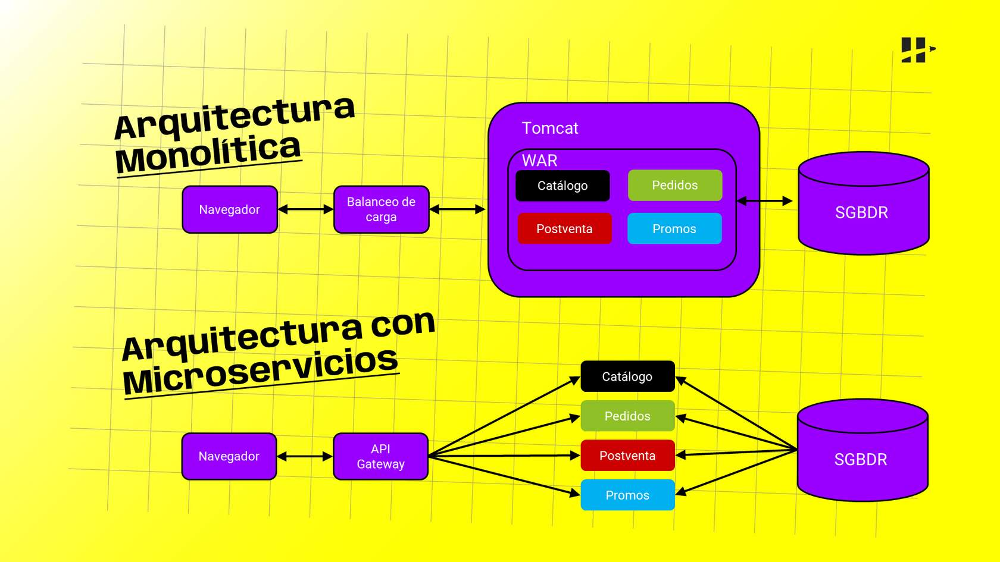
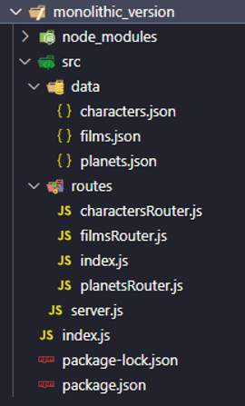
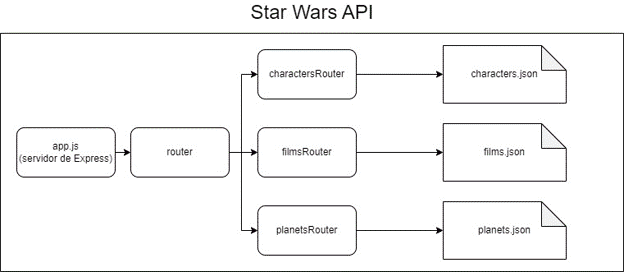
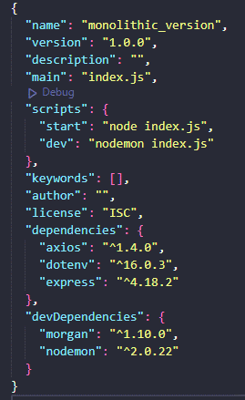

# Módulo 1

# ¿Qué aprenderemos?

- **Comprender la arquitectura de microservicios** y cómo se diferencia de la arquitectura monolítica.
- **Diseñar una aplicación** utilizando la arquitectura de microservicios.

 

# Introducción a la arquitectura

**La arquitectura de microservicios** es un enfoque moderno para desarrollar y desplegar aplicaciones de software que se basa en la idea de construir aplicaciones como **un conjunto de servicios pequeños, autónomos y altamente escalables** que se ejecutan de forma independiente y se comunican entre sí a través de interfaces bien definidas.

> Cada microservicio se enfoca en una única funcionalidad o tarea específica y se puede desarrollar, desplegar y escalar de manera independiente, lo que permite una mayor flexibilidad y agilidad en el desarrollo de aplicaciones.

A diferencia de la **arquitectura monolítica**, donde todas las funcionalidades se encuentran integradas en una única aplicación, la arquitectura de microservicios promueve la división de la aplicación en pequeños servicios independientes que pueden ser desarrollados, desplegados y escalados de forma individual. **Cada microservicio se ejecuta en su propio entorno**, con su propia base de datos, configuración y recursos, lo que permite una mayor modularidad y autonomía.

Una de las principales características de la arquitectura de microservicios es la **comunicación a través de interfaces** bien definidas. Los microservicios se comunican entre sí a través de interfaces, como **API RESTful, mensajes asincrónicos o eventos**, lo que permite una mayor desacoplamiento entre los servicios y facilita la integración y evolución de la aplicación en el tiempo.

Además, la arquitectura de microservicios fomenta el uso de tecnologías y herramientas que facilitan la automatización, el monitoreo y la gestión de los servicios, como contenedores, orquestadores, herramientas de descubrimiento de servicios, entre otros.

 

# Pros y contras

> Toda arquitectura de desarrollo de software tiene fortalezas (Pros), desventajas (Contras) y limitaciones dependiendo del contexto y objetivo del proyecto.

A continuación vamos a conocer cuales son las ventajas (Pros) de la arquitectura de microservicios:

  
<b>Escalabilidad</b>

  
  Los microservicios permiten escalar cada servicio de forma independiente, lo que permite adaptar la capacidad de la aplicación a las necesidades específicas, optimizando el uso de recursos.

  
<b>Flexibilidad y agilidad</b>

  
  Los microservicios facilitan la implementación de cambios y actualizaciones en la aplicación de manera rápida y aislada, sin afectar a otros servicios, lo que permite una mayor flexibilidad y agilidad en el desarrollo y despliegue de aplicaciones.

  
<b>Modularidad</b>

  
  Los microservicios se enfocan en una única funcionalidad o tarea, lo que permite una mayor modularidad en el diseño y desarrollo de la aplicación. Esto facilita la reutilización, el mantenimiento y la evolución de los servicios de forma individual.

  
<b>Independencia tecnológica</b>

  
  Cada microservicio puede utilizar diferentes tecnologías, bases de datos y frameworks, lo que permite una mayor libertad en la elección de tecnologías y herramientas adecuadas para cada servicio, sin estar limitado por una única tecnología en toda la aplicación.

  
<b>Desacoplamiento</b>

  
  Los microservicios se comunican a través de interfaces bien definidas, lo que permite un bajo acoplamiento entre los servicios. Esto facilita la integración con otros sistemas y permite una mayor evolución y compatibilidad de la aplicación en el tiempo.

  
  
 

Luego de conoces sus fortalezas, también es fundamental conocer las **limitaciones o desventajas** de este tipo de arquitectura.

  
<b>Complejidad</b>

  
  La gestión de un sistema distribuido de microservicios puede ser compleja, ya que implica la orquestación, monitorización y gestión de múltiples servicios en diferentes entornos.

  
<b>Mayor overhead</b>

  
  La comunicación entre microservicios puede tener un overhead adicional, como la latencia de red y la necesidad de implementar mecanismos de seguridad y gestión de errores en las interfaces de comunicación.

  
<b>Mayor esfuerzo de desarrollo inicial</b>

  
  La construcción de una arquitectura de microservicios puede requerir un mayor esfuerzo de desarrollo inicial para la creación y configuración de múltiples servicios, infraestructuras de comunicación y herramientas de gestión.

  
<b>Mayor complejidad en el despliegue</b>

  
  El despliegue de microservicios puede requerir una mayor complejidad en la gestión de la infraestructura, como el uso de herramientas de orquestación de contenedores y sistemas de descubrimiento de servicios.

  
<b>Reto en la gestión de transacciones</b>

  
  La gestión de transacciones en una arquitectura de microservicios puede ser más compleja, ya que las transacciones distribuidas pueden ser difíciles de manejar entre diferentes servicios.

 

# Introducción a Docker

> "Es una plataforma de virtualización a nivel de sistema operativo que permite la creación, empaquetado y distribución de aplicaciones en contenedores. Los contenedores Docker son aislados y encapsulan todo lo necesario para que una aplicación se ejecute de manera consistente en cualquier entorno, independientemente de las diferencias en la infraestructura subyacente"  
> RedHat.com

### **En otras palabras, podemos decir que...**

Docker es una herramienta que te permite **empaquetar tu aplicación Node.js, junto con todas sus dependencias y configuraciones**, en un 'contenedor' portátil. Este contenedor se asemeja a un caja virtual que contiene todo lo necesario para que tu aplicación Node.js funcione correctamente, incluyendo la versión específica de Node.js, las bibliotecas y todos los paquetes de npm necesarios.

Imagina que tu aplicación Node.js es una casa con sus propios muebles y electrodomésticos. Docker sería como una caja de mudanza que empaca todos los elementos necesarios para tu casa en un solo lugar, de manera ordenada y segura. Luego, puedes llevar esa caja de mudanza a cualquier lugar, como un nuevo servidor o el entorno de desarrollo de tu colega, y asegurarte de que todos los elementos de tu casa estén en su lugar correcto y funcionando sin problemas.

[En el siguiente video 👀 podrás conocer la importancia de Docker y su potencial](https://www.youtube.com/watch?v=-bS36SMr2Yw)

Además de los beneficios comentados en el video anterior, **Docker** es una herramienta extremadamente útil al **trabajar con microservicios** por varias razones que detallamos a continuación:

  
<b>Independencia de dependencias</b>

  
  Los microservicios suelen ser pequeñas aplicaciones o componentes de una aplicación más grande que se ejecutan de forma independiente. Cada microservicio puede tener sus propias dependencias y configuraciones específicas. Docker permite empaquetar cada microservicio junto con sus dependencias en un contenedor independiente. Esto asegura que cada microservicio tenga su propio entorno aislado y no se vea afectado por las dependencias de otros microservicios o del sistema operativo en el que se ejecutan.

  
<b>Portabilidad</b>

  
  Docker permite empaquetar un microservicio y todas sus dependencias en un contenedor, lo que lo hace altamente portátil. Puedes mover fácilmente el contenedor de un entorno a otro, como de desarrollo a producción, o entre diferentes servidores o plataformas en la nube. Esto facilita la implementación y despliegue de microservicios en diferentes entornos sin preocuparse por las diferencias en la configuración del sistema operativo o las dependencias.

  
<b>Escalabilidad</b>

  
  Los microservicios suelen diseñarse para escalar horizontalmente, lo que significa que se pueden ejecutar varias instancias del mismo microservicio para manejar cargas de trabajo crecientes. Docker facilita la replicación y el escalado de microservicios al permitir la creación de múltiples contenedores a partir de la misma imagen de Docker. Esto hace que sea sencillo agregar o quitar instancias de microservicios según sea necesario para adaptarse a los cambios en la demanda.

  
<b>Consistencia y reproducibilidad</b>

  
  Docker asegura que los microservicios se ejecuten de la misma manera en todos los entornos, lo que garantiza la consistencia en el desarrollo, prueba y producción. Además, Docker permite definir la configuración del contenedor en un archivo llamado Dockerfile, lo que facilita la reproducción del entorno de ejecución del microservicio en diferentes etapas del ciclo de vida del desarrollo de software, desde el desarrollo local hasta la producción.

  
<b>Facilidad en la gestión</b>

  
  Docker proporciona una interfaz de línea de comandos y una interfaz gráfica de usuario que facilita la gestión de los contenedores de microservicios. Puedes iniciar, detener, reiniciar o eliminar contenedores con simples comandos o acciones de interfaz gráfica. Además, Docker tiene una amplia comunidad y un ecosistema de herramientas y servicios que facilitan la gestión y monitoreo de microservicios.

 

# Instalación de Docker

Luego de conocer los beneficios de Docker, vamos a **instalar la aplicación** en tu sistema operativo.

[En el siguiente video podrás conocer como instalar Docker en Windows](https://www.youtube.com/watch?v=BK-C2RofmTE&t=16s)

Luego de instalar Docker correctamente, vamos explorar cómo crear un Aplicación de NodeJS en Docker.

[Enlace](https://www.youtube.com/watch?v=iLlmm0L-VpQ&t=47s)

En el video anterior se demostró como crear una aplicación sencilla en Docker, ahora vamos a poner manos a la obra para comenzar con nuestra primera **Homework**.

 

# Proyecto Star Wars API

Para esta actividad deberás contar con este [repositorio](https://github.com/soyHenry/be-ct-upskilling-microservicios) (o la carpeta repositorio), será la base de lo que estaremos creando. Este proyecto se trata de una **API de Star Wars**, que maneja información sobre los personajes de la franquicia (Characters), las películas que se han lanzado (Films) y los planetas que aparecen en dichas películas (Planets).

Podrás notar que este repositorio contiene un proyecto de **Nodejs** similar a los que ya has desarrollado durante la carrera:

1. Un servidor web HTTP creado con la librería Express.
2. Un enrutador al cual el servidor le delega el enrutado de la aplicación.
3. Tres (3) routers que se encargan de definir rutas para cada una de las entidades que trabajamos (Films, Characters y Planets).
4. Los controladores de las rutas no se comunican (por el momento) con ninguna Base de Datos, sino que obtienen los datos a partir de unos archivos Json que contienen los registros para cada una de las entidades.

Te dejamos además un vistazo del **package.json** que posee hasta el momento con las dependencias instaladas. Por el momento **no necesitaremos más dependencias que estas**.

Tanto la estructura del proyecto como las funcionalidades que posee hasta el momento son las que ya conocemos. Esta aplicación, como verás, se ajusta a la **estructura monolítica** que vimos en pasos anteriores:

- Cuenta con una única aplicación de Express que se encarga de manejar todo el servicio.
- Toda la aplicación se expone en un único puerto del host donde se encuentre.
- Si bien la lógica de negocio de la aplicación se irá definiendo en rutas y enrutadores distintos, al final del camino todo forma parte de una única aplicación.

## -------------------- **Clase** --------------------

El objetivo es poder hacer que toda la lógica este dividida en microservicios. Cuando hablamos de microservicios, estamos hablando de pequeñas aplicaciones de Express en nuestro caso.

Nuestro objetivo es poder hacer que tengamos tres aplicaciones pequeñas, una que se encargue de gestionar la información de los personajes, otra que se encargue de gestionar la información de las películas y otra de los planetas.

Los controladores de las rutas, manejan los datos de un json, más adelante lo pasaremos a una base de datos. Vamos a ver que la gestión de los datos en la base de datos, también sea un microservicio aparte.

## -------------------- **Fin clase** --------------------

 

# HW 1 - Actividad 1

Esta primera Homework está estructurada en dos actividades con objetivos muy específicos:

## Actividad 1

Debes lograr **dividir esta aplicación en aplicaciones más pequeñas y sencillas**, que involucren un único aspecto, entidad o funcionalidad del proyecto.

