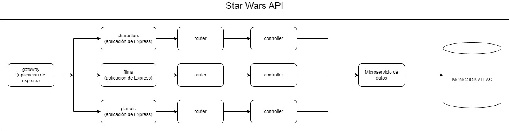

# Módulo 2

 

# ¿Qué aprenderemos?

- **Integrar** una Base de Datos No SQL, como MongoDB, en una arquitectura de microservicios.
- **Crear** y **configurar** un cluster de datos de MongoDB en [MongoDB Atlas](https://www.mongodb.com/), utilizando las herramientas disponibles en la capa gratuita.
- **Delegar** la comunicación de datos a un microservicio especializado, separando así la lógica de las consultas a la Base de Datos de los demás microservicios.
- **Utilizar** la librería [Mongoose ](https://mongoosejs.com/) para comunicarte con la Base de Datos MongoDB desde Javascript.

 

# Introducción a Bases de datos No SQL

Una **base de datos NoSQL**, también conocida como base de datos NoSQL (Not Only SQL), es un tipo de base de datos diseñada para almacenar y recuperar grandes volúmenes de datos no estructurados o semi-estructurados.

> Estas bases de datos son ampliamente utilizadas en aplicaciones modernas que requieren un alto rendimiento, como aplicaciones web, sistemas de gestión de contenido, aplicaciones de Big Data y IoT (Internet de las cosas), entre otros. Algunos ejemplos populares de bases de datos NoSQL incluyen MongoDB, Cassandra, Redis, Couchbase y Neo4j.

A diferencia de las bases de datos SQL tradicionales, las bases de datos NoSQL no utilizan el lenguaje SQL para consultar y manipular los datos, sino que **emplean diferentes modelos de datos**, como el modelo de documentos, el modelo de columnas, el modelo clave-valor o el modelo de grafos.

## SQL vs. NoSQL

Mira con atención la siguiente tabla para atender a las diferencias entre estos dos modelos de base de datos.

|                          | SQL                                                                                             | NoSQL                                                                                                                                       |
| ------------------------ | ----------------------------------------------------------------------------------------------- | ------------------------------------------------------------------------------------------------------------------------------------------- |
| Estructura de datos      | Utiliza tablas y filas estructuradas                                                            | Utiliza diversos modelos de datos estructurados o no estructurados                                                                          |
| Escalabilidad            | Verticalmente escalable (escalado hacia arriba, más potencia en el servidor)                    | Horizontalmente escalable (escalado hacia fuera, agregando más servidores)                                                                  |
| Esquema                  | Define un esquema rígido antes de almacenar los datos                                           | No requiere un esquema fijo, lo que permite flexibilidad en la estructura de los datos                                                      |
| Consultas                | Utiliza SQL para consultas y manipulación de datos                                              | Utiliza modelos de consulta específicos según el modelo de datos (p. ej., consultas basadas en documentos, consultas de búsqueda de claves) |
| Transacciones            | Soporta transacciones ACID (Atomicidad, Consistencia, Aislamiento, Durabilidad)                 | Algunas bases de datos NoSQL admiten transacciones, pero no todas                                                                           |
| Escalabilidad horizontal | Menos adecuado para grandes volúmenes de datos y cargas de trabajo escalables horizontalmente   | Más adecuado para grandes volúmenes de datos y cargas de trabajo escalables horizontalmente                                                 |
| Flexibilidad             | Menos flexible en términos de cambios en el esquema y adaptabilidad a diferentes tipos de datos | Mayor flexibilidad para manejar cambios en la estructura de los datos y adaptarse a diferentes tipos de datos                               |
| Madurez y adopción       | Largo historial de desarrollo y amplia adopción en la industria                                 | Relativamente más reciente y menos adopción generalizada en comparación con las bases de datos SQL                                          |
| Ejemplos                 | MySQL, PostgreSQL, Oracle                                                                       | MongoDB, Cassandra, Redis, CouchDB, Neo4j                                                                                                   |

 

# ¿Por qué NoSQL y microservicios?

> Las Bases de Datos No SQL suelen ser más apropiadas en algunos sistemas de microservicios por varias razones.
> ¡Conozcamos cada una de ellas!

  
<b>Escalabilidad horizontal</b>

  
  Las bases de datos NoSQL están diseñadas para escalar horizontalmente, lo que significa que puedes agregar más nodos o servidores para manejar el aumento de la carga de trabajo.

Esto es especialmente importante en una arquitectura de microservicios, donde cada microservicio puede tener su propia base de datos y necesitar una capacidad de escalado independiente.

Las bases de datos NoSQL facilitan la distribución y partición de datos entre múltiples nodos, permitiendo un escalado más eficiente.

  
<b>Esquema flexible</b>

  
  En una arquitectura de microservicios, los microservicios pueden evolucionar de forma independiente y tener diferentes requisitos de datos. Una base de datos NoSQL proporciona una mayor flexibilidad en términos de cambios en el esquema, lo que facilita la adición, modificación o eliminación de atributos de datos sin afectar a otros microservicios.

Esto es especialmente útil cuando se trabaja en un entorno ágil o se necesita una rápida adaptación a los cambios en los requerimientos del sistema.

  
<b>Modelo de datos adecuado</b>

  
  Las bases de datos NoSQL ofrecen diferentes modelos de datos, como documentos, columnas, claves-valor y grafos. Estos modelos se ajustan bien a diferentes tipos de microservicios y escenarios de uso.

Por ejemplo, una base de datos de documentos como MongoDB es adecuada para almacenar datos semiestructurados, mientras que una base de datos de grafos como Neo4j es útil para representar relaciones complejas entre los datos. Puedes seleccionar el modelo de datos más adecuado para cada microservicio según sus necesidades específicas.

  
<b>Rendimiento y velocidad</b>

  
  Las bases de datos NoSQL están optimizadas para consultas rápidas y operaciones de escritura eficientes. En una arquitectura de microservicios, donde los microservicios se ejecutan de forma independiente y deben responder rápidamente a las solicitudes, una base de datos NoSQL puede ofrecer un rendimiento superior.

Además, algunos modelos de bases de datos NoSQL, como las bases de datos en memoria (como Redis), proporcionan una latencia extremadamente baja y son ideales para casos de uso donde la velocidad es crítica.

  
<b>Adaptabilidad a la escala y la variedad</b>

  
  En una arquitectura de microservicios, los microservicios pueden tener diferentes cargas de trabajo y requerir diferentes tipos de almacenamiento de datos.

Las bases de datos NoSQL ofrecen una variedad de opciones de almacenamiento, como bases de datos de alto rendimiento en memoria, almacenamiento en caché distribuido y almacenamiento masivo en disco. Esto permite adaptar el almacenamiento de datos según las necesidades específicas de cada microservicio y escalarlos individualmente.

 

# Introducción a Mongo DB y Mongo DB Atlas

## ¿Qué es Mongo DB?

> MongoDB es una base de datos NoSQL orientada a documentos, lo que significa que almacena los datos en forma de documentos similares a JSON en lugar de utilizar tablas y filas como las bases de datos relacionales tradicionales.

### Algunas de sus características...

1. Fue desarrollada con el objetivo de brindar escalabilidad, flexibilidad y rendimiento en entornos de aplicaciones modernas.
2. Utiliza un modelo de datos flexible y dinámico, lo que permite almacenar datos con estructuras variables dentro de un mismo conjunto de datos. Esto significa que no se requiere un esquema fijo y predefinido, lo que facilita la iteración y evolución de las aplicaciones.
3. Permite distribuir la carga de trabajo en múltiples servidores y manejar grandes volúmenes de datos. Esto es especialmente útil en aplicaciones con altas demandas de rendimiento y escalabilidad.
4. Ofrece una amplia gama de características y funcionalidades, como índices flexibles, consultas ad hoc poderosas, replicación automática para alta disponibilidad, fragmentación de datos (sharding) para distribuir la carga y tolerancia a fallos, y soporte para operaciones geoespaciales.
5. Se utiliza en una variedad de aplicaciones y casos de uso, desde aplicaciones web y móviles hasta sistemas de gestión de contenido, análisis de datos, IoT y muchas otras áreas donde la flexibilidad y el rendimiento son fundamentales.

## ¿Qué Mongo DB Atlas?

> MongoDB Atlas es un servicio de base de datos en la nube ofrecido por MongoDB. Proporciona una forma fácil y conveniente de alojar, administrar y escalar clústeres de bases de datos MongoDB en entornos en la nube, sin tener que preocuparse por la configuración y el mantenimiento de la infraestructura subyacente.

### Algunas de sus características...

1. Los usuarios pueden crear clústeres de bases de datos MongoDB con unos pocos clics.
2. El servicio se encarga de aspectos como aprovisionamiento de hardware, configuración de la red, configuración de seguridad y respaldo de datos.
3. Permite a los desarrolladores centrarse en el desarrollo de sus aplicaciones en lugar de preocuparse por la administración de la infraestructura.

 

# ¡Manos a la obra!

> 👀 Para poder continuar con nuestra actividad, utilizaremos como BDD No-SQL a MongoDB.

### Recordemos...

**MongoDB** es una base de datos NoSQL orientada a documentos. En lugar de utilizar tablas y filas como en las bases de datos SQL tradicionales, MongoDB almacena los datos en documentos BSON (Binary JSON).

Esta base de datos no la trabajaremos de forma local, sino que estará alojada en un cluster de **MongoDB Atlas**. Este es un servicio de base de datos en la nube ofrecido por MongoDB. Es una plataforma de base de datos como servicio (DBaaS) que permite a los usuarios desplegar, gestionar y escalar clústeres de bases de datos MongoDB en la nube de forma sencilla y que posee además una capa gratuita bastante robusta.

En el siguiente video podrás ver el paso a paso para la creación de un cluster en MongoDB Atlas y a partir de allí empezar a crear tu Base de Datos.

[Video](https://www.youtube.com/watch?v=J61_hiFauNs)

En el video anterior se demostró como crear un cluster para crear a partir de allí nuestra BDD.

 

# HW 2 parte I

> En esta actividad nos centraremos en la creación de un microservicio dedicado exclusivamente a la conexión e interacción con nuestra base de datos.

Al finalizar esta actividad, tendremos una arquitectura similar a la siguiente:

Ten en cuenta que para poder iniciar con esta actividad, es importante que hayas generado correctamente tu cluster de datos en MongoDB Atlas. 

Además, debes haber instalado en tu computadora MongoDB Compass. Esta herramienta nos servirá para poder precargar los datos que ya tenemos de forma súper sencilla, y sin tener que estar generando scripts a mano para este proceso.

## ¡Comencemos! 

### **1**

En esta primera parte, crearemos con la ayuda de **MongoDB Compass** la Base de Datos de nuestro proyecto.

Luego, importamos los datos que ya tenemos guardados en nuestros archivos JSON. De esta manera, de forma muy sencilla y sin tener que desarrollar scripts, podremos tener la precarga terminada en nuestra Base de Datos y estar listos para continuar.

### ------------------------------ **Clase** ------------------------------

Ya tengo que tener creado nuestro Cluster de MongoDB Atlas y haber descargado MongoDB Compass, para hacer la precarga de los datos que necesitamos para poder trabajar.

### En MongoDB Atlas

Voy a **Database Access** y cuando lleguemos ya vamos a tener un usuario Creado al momento de crear el clúster, que tiene una contraseña que se guenera aleatoriamente y a veces no la anotamos y no la podemos recupera y tenemos que reiniciar la contraseña.

Entonces lo mejor es crear un usuario.

Ahora voy a **Network Access**, Qué cuando entro veo escrita mi IP, La puedo editar y cambiar la por `0.0.0.0/0`, Que esto significa que podemos conectar a nuestro clúster desde cualquier IP. El principio es aconsejable dejarlode esta forma, luego la podemos cambiar cuando nuestra aplicación este desplegada.

Luego voy a **Database** y hacemos click en **Connect**. Nos da opciones de cómo nos queremos conectar. Elegimos la opción de **Compass**, Y nos va a dar una URL, la vamos a copiar y a pasar a **MongoDB Compass**.

### En MongoDB Compass

Pego la URL donde dice **URI**. Tengo que cambiar el `user` y el `password` y hago click en **Connect**. Y MongoDB Compass se va a conectar con nuestro clúster.

Voy a **Database**, hago click en **Create database** y le llamos `star_wars`, nos va a pedir el nombre de una primera colección, que sería como una primera tabla, Que en realidad serían colecciones, y le llamo `characters`.

Antes de importar Tengo que entrar al archivo `json` y cambiar los `id` por `_id`, por que MongoDB Atlas le llama así a los id.

Entro a la base de datos y en `characters` hago clic en **Import Data**. 

Ya tengo cargado toda la información que tenia en nuestro archivo `json`, en la colección `characters`. Hago lo mismo con `films` y `planets`.

### ------------------------------ **Fin clase** ------------------------------