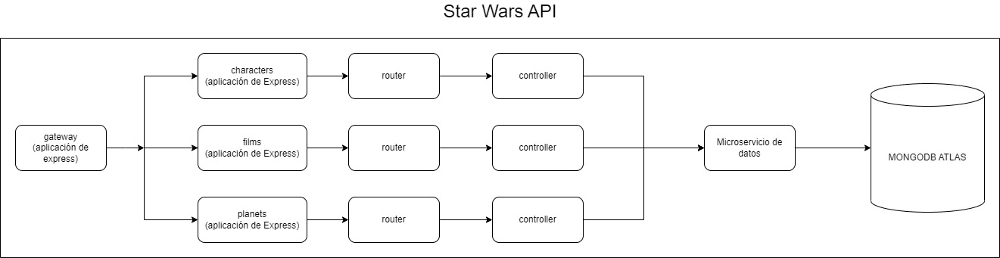

# Upskilling Backend

Aplicación de backend usando la arquitectura de microservicios desarrollada con:
- Express
- MongoDB
- Docker
- Máquinas virtuales de Google Cloud

Esta desarrollado siguiendo el curso dictado por el **Bootcamp Henry**.

El paso a paso del curso estan en los archivos [M1.md](M1.md), [M2.md](M2.md) y [M3.md](M3.md).

Servicios desplegados durante 90 días que dura el servicio gratuito de Google:
- http://34.125.189.36:8000/characters
- http://34.125.189.36:8000/films
- http://34.125.189.36:8000/planets

[The_CodeChannel](https://www.twitch.tv/the_codechannel) canal de Twitch del profesor que dio el curso.